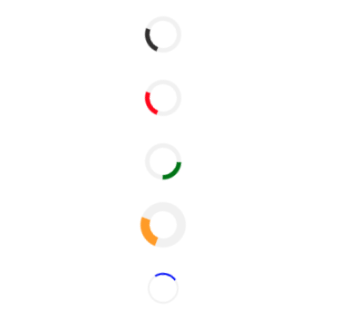

# Pwnspinner - npm package

Simple loading spinner **Pwnspinner** for React.js/TypeScript installable via npm.  
Version 2.1.0 is stable TypeScript parametrized version of spinner. Use ^2.1.0.
## Available options
Use `<Pwnspinner/>` with some voluntary props `color, thickness, speed`.
```jsx
    <>
      <Pwnspinner />
      <Pwnspinner color="red" />
      <Pwnspinner color="green" speed={1.9} />
      <Pwnspinner color="orange" thickness={10} />
      <Pwnspinner color="blue" speed={0.7} thickness={2} />
    </>
```
*Code showing default spinner version, then some parametrized by props.* 
<p align="center">
  
</p>

## Usages
- Waiting for fetched load to be displayed.
- Waiting for POST/PUT request response message succ/err.
## Usecase - waiting for API endpoint fetch
```JSX
import React, { useEffect, useState } from 'react';
//Fetches
import FetchList from '../fetches/FetchList';
//Redux/RTK
import { setList } from '../redux-rtk/listSlice';
//Pwnspinner
import { Pwnspinner } from 'pwnspinner'; // <-- (!) import our Pwnspinner

function YourComponent() {
    const dispatch = useDispatch();
    const [spinner, setSpinner] = useState(true); // <-- (!) spinner visibility variable
    //Fetch downloaded list from Redux
    const list = useSelector(state=>state.list.list)
    useEffect(() => {
        const list = FetchList();
        Promise.resolve(list) // <-- (!) wait to fetch/resolve your stuff
            .then((result) => {
                dispatch(setList(result))
                setSpinner(false) // <-- (!) set Pwnspinner to not be visible anymore
            })
            .catch((e: any) => {
                console.log(e)
            })
    })
    return(
        <div>
            { spinner // <-- (!) spinner visibility variable
                ? <Pwnspinner/> // <-- (!) while 1 
                : <Displaylistcomp list={list} />  // <-- (!) after 0
            }
        <div/>
    )
}
```
___

## Future development
Hit us up about what functionality are you missing!
https://github.com/KlosStepan/Pwnspinner

## TODO list
- [ ] Parametr `boxing` either small or medium (padding 0 vs normal).